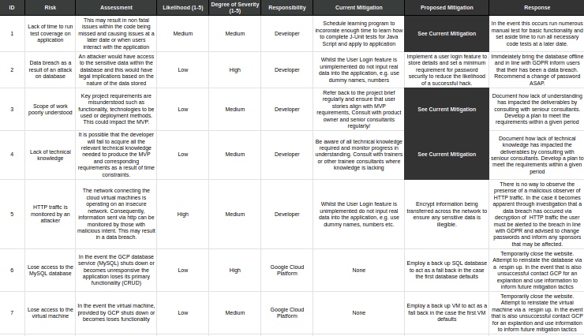
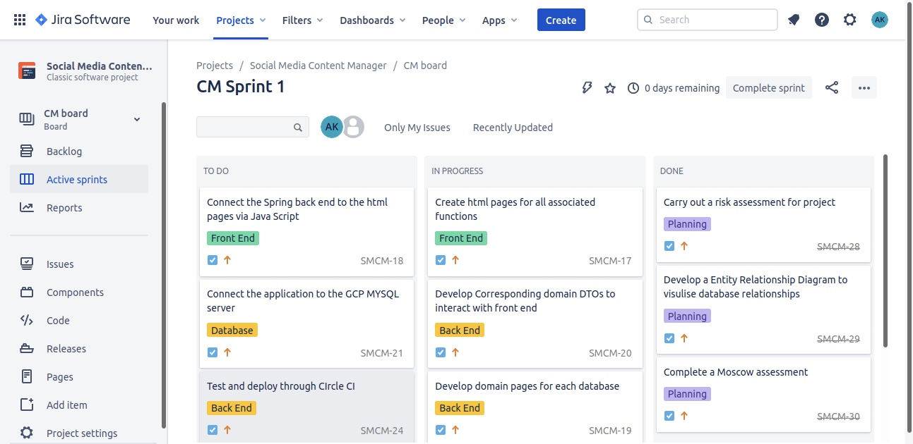
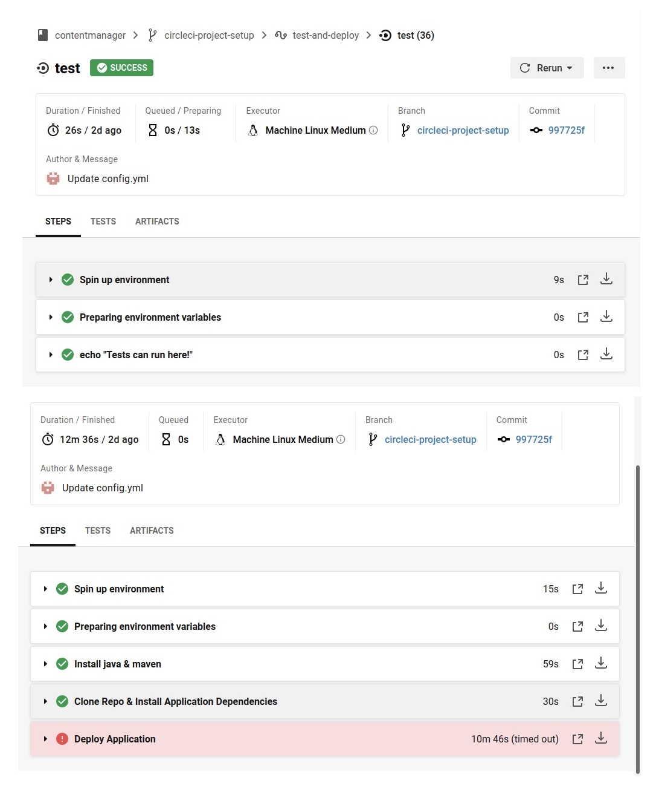

# SFIA Project 1:
## Social Media Content Manager

### Contents 
* Project Brief 
  * Objective
  * Minimum Requirements
  * Constraints 
* Application Overview 
  * Description
  * Functionality 
* Risk Assessment 
* Project Tracking 
* Architecture 
  * Database Structure 
  * CI Pipeline
* Testing 
* Front End Design
* Issues
* Improvements

### Project Brief
**Objective:** 

Create a CRUD application that demonstrates an understanding of key concepts, tools and methodologies as outlined in the _QA Cloud Native_ core modules. 

**Minimum Requirements:** 
1. Demonstrate agile working through devloped kanban board 
2. Detailed risk assessment
3. A relational database used to store project data 
4. Create an Application in the OOP language that meets the requirements outlined in the kanban board
5. Develop a functioning front end website and integrated API for application
6. Employ fully designed test suites and ongoing automated testing for application validation
7. Meet acceptable level of test coverage and supply reports to support this
8. Integrate code into a Version Control System
9. Build Code through a CI server 
10. Deploy the application through a cloud based virtual machine

**Constraints:**
| Technology           | Constraint  |
| -----------          | ----------- |
| Kanban Board         | Jira        |
| Database             | GCP Managed SQL Server|
| Programming language | Java|
| Front-End            | HTML, CSS and JavaScript |
| Unit Tests           | JUnit and Mockito |
| Integration Test     | Selenium |
| Version Control      | Git      |
| CI Server            | CircleCI  |
| Cloud server         | GCP virtual machine   |

### Application Overview:
**Description:**

This application is designed to allow users to store manage their social media content posts through idea phase to successful post.

**Functionality:**

The Application allows users to do the following :
* Enter data on indiviual posts with the folllowing details (CREATE)
  * Title of the Post **_e.g Scholarship Announcement_**
  * Content Type **_e.g Infographic_**
  * Social Media Platform **_e.g Instagram_**
  * Content Status **_e.g Editing_**
  * Projected Post Date **_e.g 05/09/2020_**
  * Sponsors **_connected to database below_**
* Store contact details for content sponors (CREATE)
  * Company Name 
  * Primary Contact Name
  * Primary Contact Email
  * Primary Contact Phone Number
  * Notes 
* View all these inputs (READ)
* Update existing sponsor entries (UPDATE)
* Delete sponsor entries (DELETE)

### Risk Assessment 
A full risk assessment was carried out before project commencenment and was monitored throughout. It includes mitigation at present but additionally, proposed mitigation in the event of more time and resources. The assessment includes risks associated with developer and technologies employed. 

The risk assessment for this project can be found in full here:
https://docs.google.com/spreadsheets/d/1NaXPK0vTBx11zCeguTTU5OSshmogoGkOOSU5_KN_VTw/edit#gid=0

A quick overview is as follows:

### Project Tracking 
Jira's Kanban board was employed to track project progress, in line with agile working principles. THe kanban board allowed for project planning guided by user stories to ensure all work woulf fulfil the needs of the end user. Epics were used to further organise and group tasks.

The full board with all sprints and users stories can be found at the following link:
https://ak21.atlassian.net/secure/RapidBoard.jspa?rapidView=3&projectKey=SMCM&selectedIssue=SMCM-26

Below is a screen shot of a sprint:

### Architecture

**Circle CI**
Circle CI was the continous integration platform of choice. The corresponding yaml file was designed to allow for automatic testing and deployment of the application via the GCP virtual machine. Circle CI improves the effciency of the development to deployment pipeline. The server can be initiated by making a simple change to the corresponding yaml file. The workflow is designed to allow testing and deployment of the app via a VM possible independent of the developers local machine.

The workflow itself has two primary steps, test and deploy.
* Test: 
  * 
* Deploy:
  * Spin Up Environment: VIrtual machine used to deploy application is initiated
  * Preparing Environmental Variables: A series of CI variables are prepared and the manual changes to project setting including establishing a SSH Host and User that match the GCP virtual machine are initiated. 
  * Install Java & Maven: The necessary programs used to build the application are installed, this also included git which is sometimes not present.
  * Clone Repo & Install Application Dependancies: This step clones the repository (with all pushed commits to date) and installs the necessary dependencies associted with the pom.xml file. 
  * Deploy Application: Given all the previous steps have been successful the application will successfully deploy and the Circle CI pipeline will time out after approximately 10 miniutes. 

### Testing 

### Front End Design 
Given the time constraint and technical knowledge level the front end is relatively basic at this stage but allows for CRUD fucntionality. It was designed using html and CSS. 

### Issues

### Future Improvements 

**Process Streamlining**
1. The sponsor update form should be automatically populated with the data associated with that sponsor id instead of users having to re-input all values and potentially make a mistake. 
2. Delete button automatically deletes the desired content rather than directing user to another page for manual input of the id. 
3. Conditional drop down meanu when inputting content e.g if Instagram platform selected then default content type options = image, video, story, reel

**Security**
1. Implement the user login feature so that multiple users can use the application and only have access to their content and sponsor details.
2. Encrypt information sent via html 

**User Display/ Design Features**
1. Sign in page as a dashboard with key statistics for content creators to track volume of content per platform, and content type. The use of pre-defined options in the forms is intended to ease the implmentation of this at a later stage. 
2. General overhaul of aesthetic component of application- images and formatting. 

